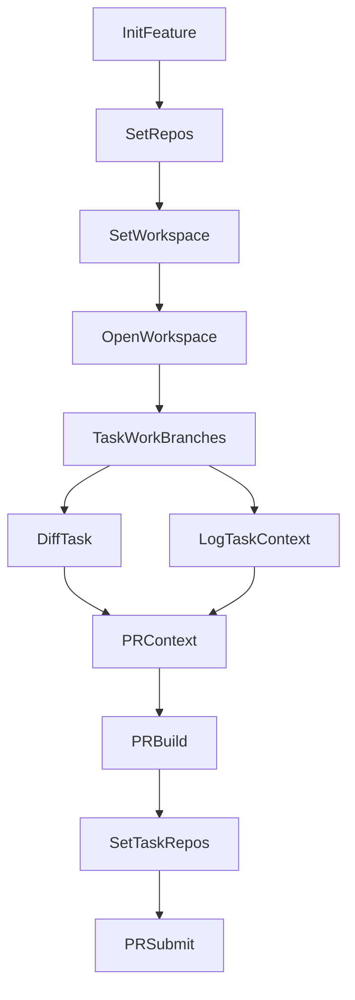

# Agentic-Lite (Demo)

Lightweight workspace template to operationalize shared mental models for a team.
This repo provides a thin-slice workflow: fetch a feature from JIRA, choose repos,
generate a VS Code workspace, capture context, and prepare PRs.

## Quick Start (1 minute)

If you are in Codespaces, setup should already be done by the devcontainer.
If startup messages were missed, run:

```bash
# 1) Validate credentials (or edit existing file)
cp config/credentials.env.example config/credentials.env
# 2) Initialize feature (child tasks fetched by default)
bin/agentic init <FEATURE-ID>

# 3) Set feature repos (active feature is used)
bin/agentic set-repos

# 4) Create/open workspace
bin/agentic set-workspace
```

Flow rules:
- `init` is feature-only; epic/task IDs are rejected in agentic-lite.
- Active feature context is saved after `init`, so `set-repos` and `set-workspace` need no feature ID.
- Use `--no-children` if you need to skip child task fetch.

## Workflow Diagram



## Core Commands

- `bin/agentic init <FEATURE-ID>`: initialize a feature + child tasks
- `bin/agentic set-repos`: configure repos for active feature
- `bin/agentic set-workspace`: clone missing repos + generate `<FEATURE>.code-workspace`
- `bin/agentic diff <TASK-ID>`: capture diffs for repos linked to that task
- `bin/agentic log <TASK-ID>`: append context in `research-notes/gained-context.md`
- `bin/agentic pr context <TASK-ID>`: build structured context bundle
- `bin/agentic pr build <TASK-ID>`: render PR description markdown
- `bin/agentic set-task-repos <TASK-ID>`: choose main/supporting repos
- `bin/agentic pr submit <TASK-ID>`: create main + supporting PRs

## Using Skills

This repo includes lightweight skills under `.github/skills/*` that Copilot can use to automate common tasks.

- Location: `.github/skills/<skill-name>/SKILL.md`
- What they do: Each skill describes a focused workflow (e.g., append a decision log, build a PR narrative, create PRs).

How to use with GitHub Copilot Chat in VS Code:

- Open Copilot Chat and ask to use a skill by name, providing the required inputs.
- Examples:
  - "Use the skill `agentic-decision-log` for TASK-456: Context=..., Decision=..., Alternatives=..., Consequences=..., Links=..."
  - "Run `agentic-pr-narrative` for FEAT-123/TASK-456 and update `pr/description.md`."
  - "Use `agentic-pr-create` for FEAT-123/TASK-456 to create main + supporting PRs."

Notes:
- Skills operate on workspace files; ensure feature/task folders exist from `bin/agentic init`.
- You can open the SKILL.md to see exact inputs and outputs each skill expects.

## Environment Variables

Set in `config/credentials.env`:

```
ATLASSIAN_BASE_URL=https://your-domain.atlassian.net
ATLASSIAN_EMAIL=you@example.com
ATLASSIAN_API_TOKEN=your_token
```

## Setup (manual, non-Codespaces)

```bash
python3 -m venv .venv
source .venv/bin/activate
pip install -r scripts/python/requirements.txt
cp config/credentials.env.example config/credentials.env
```

## Notes

- Repos are cloned into a sibling `../repos` folder (relative to this repo).
- Branching for code repos is manual. Branches should be prefixed with the task ID.
- The PR template is in `.github/PULL_REQUEST_TEMPLATE.md`.
- The generated workspace auto-opens one terminal for `agentic-lite` and one per repo; each loads credentials and activates `.venv` if present.
- Repo setup is run during `set-workspace` (not automatically on workspace open) to avoid non-interactive auth hangs.


