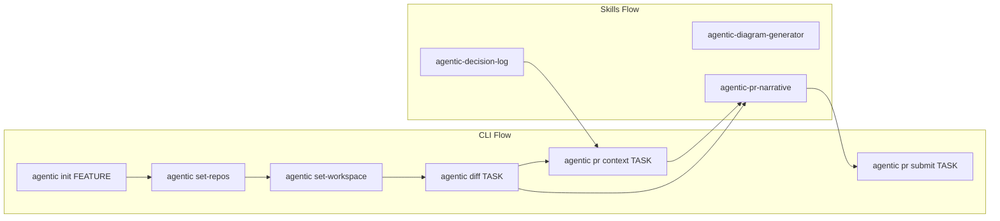

# Agentic-Lite

Lightweight developer workspace to operationalize shared context around one feature and its tasks.

## Quick Start

```bash
# 1) Configure credentials
cp config/credentials.env.example config/credentials.env

# 2) Initialize from JIRA feature
bin/agentic init <FEATURE-ID>

# 3) Configure repos for this feature
bin/agentic set-repos

# 4) Clone repos + generate workspace
bin/agentic set-workspace
```

Notes:
- `init` is feature-only (epics/tasks are intentionally rejected).
- Child tasks are fetched by default (`--no-children` to skip).
- Active feature context is persisted, so `set-repos` and `set-workspace` normally need no feature ID.

## Workflow (Simple)



## Responsibilities

- CLI commands handle deterministic operations (setup, cloning, diff/context generation, PR submission).
- Skills assist with writing and documentation artifacts (decision log, PR narrative, architecture diagram).
- PR creation/submission is CLI-owned (`agentic pr submit`), not skill-owned.

## Core CLI Commands

- `bin/agentic init <FEATURE-ID>`: initialize feature + child tasks.
- `bin/agentic set-repos`: configure feature repos.
- `bin/agentic set-workspace`: clone missing repos and generate workspace file.
- `bin/agentic diff <TASK-ID>`: capture task-relevant diffs.
- `bin/agentic pr context <TASK-ID>`: build structured PR context bundle.
- `bin/agentic set-task-repos <TASK-ID>`: choose main/supporting repos for a task.
- `bin/agentic pr submit <TASK-ID>`: create main + supporting PRs.

## Skills

Skills live under `.github/skills/`:

- `agentic-decision-log`: append structured context/decision notes.
- `agentic-pr-narrative`: generate/update PR description from context + diffs.
- `agentic-diagram-generator`: generate architecture diagram markdown from template.

## Environment

Set in `config/credentials.env`:

```bash
ATLASSIAN_BASE_URL=https://your-domain.atlassian.net
ATLASSIAN_EMAIL=you@example.com
ATLASSIAN_API_TOKEN=your_token
GH_TOKEN=your_pat_token
```

## Manual Setup (non-Codespaces)

```bash
python3 -m venv .venv
source .venv/bin/activate
pip install -r scripts/python/requirements.txt
cp config/credentials.env.example config/credentials.env
```

## Practical Notes

- Repos are cloned in sibling folder `../repos`.
- Branch naming is manual; prefix branches with task ID.
- PR template: `.github/PULL_REQUEST_TEMPLATE.md`.


